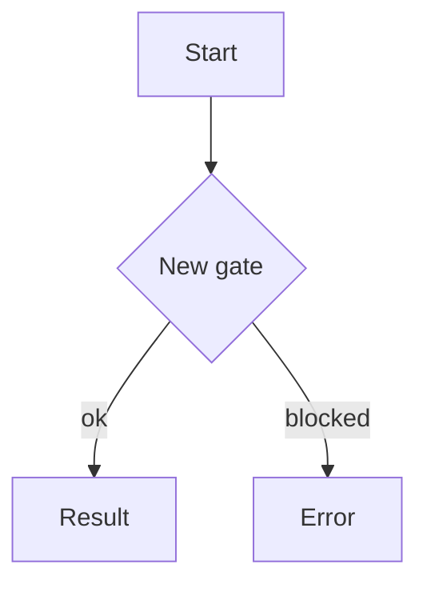

<!--
  PRs in Tommy's repos follow the "newspaper / information-pyramid" framework:
  one self-contained front page that reads top-to-bottom on an iPad-mini portrait
  display (1–2 pages; up to 4 for very complex *code* changes). Most newsworthy
  facts first, supporting detail below, fine print last.

  Full rules + voice: github.com/tommyroar/.github/blob/main/PR_FRAMEWORK.md
  Two gates check this body: `pr-structure-gate` (a hard CI check — one H1, an
  italic dek, a `> [!NOTE]` masthead, alt text, no heading skips; it BLOCKS if the
  spine is missing) and `pr-style-review` (an agentic, non-blocking length/style/
  diagram reviewer). An agent that opens/updates a PR regenerates the body from the
  *full* diff; rebuilt from scratch, never appended to.

  Fill the panel below and DELETE any section that is genuinely empty (don't leave
  empty headers, and don't pad to fill the budget).
-->

`<AREA>` — **<RUBRIC>**

# <Evocative but accurate headline — a real title, not "Update X">

> _<Dek: 1–2 italic sentences setting the stakes. Stands alone as the lede.>_

> [!NOTE]
> **<area>** · feat · risk: low · closes #000

<Narrative lede: a short paragraph that hooks the reader and states the problem / why.>

## <Punchy subhead for the core idea>
- <Grouped, scannable bullets, one idea each.>

> _"<Pull quote — the single line that captures the point.>"_

## How it flows

<!-- Omit only if no flow changed — and say so explicitly. Orient TD (top-down), not LR. -->

## Screens & wireframes
<!-- Every available image/wireframe/mockup, width-bounded, with alt text.
     Private repo: link committed figures by blob URL (raw URLs don't render). -->

## Verification
- <Commands run / tests / manual checks, with outcomes.>

## Risk & rollout
- <Migrations, feature flags, rollback plan, follow-ups.>
