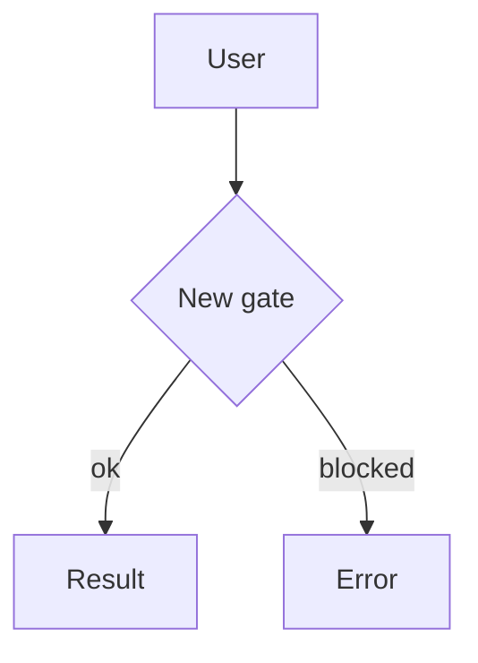

# PR Framework — the "Newspaper / Information-Pyramid" PR description

> Canonical reference for **any agent** writing a GitHub pull-request description in
> Tommy's workspaces. Read this before composing a PR body, then validate the body
> with `validate_pr.py` (next to this file) before opening or updating the PR.

## The one rule

A PR description is **one single descriptive panel** — a newspaper front page that
renders top-to-bottom as a self-contained *information pyramid*: the most newsworthy
facts first, supporting detail below, fine print last. It reads cleanly on an **iPad
mini portrait** at **1–2 pages** (up to 4 only for very complex code changes; see the
length budget below), with no horizontal scroll.

A reader who only sees the first screen should already understand **what changed, why,
and the blast radius.** Everything below is progressive disclosure.

## Information pyramid (top → bottom) — written like a Wired feature

Voice: confident, present-tense, declarative editorial prose. Lead with the stakes, not
the implementation. Use the magazine furniture below; keep it within the length budget.

0. **Kicker** *(optional)* — one short rubric line above the headline, e.g.
   `` `BACKEND` — **DESIGN DISPATCH** `` (≤ 48 chars). Sets the section/category.
1. **Headline** — one `#` line: evocative but accurate (a real title, not "Update X").
   **The PR title mirrors this headline, prefixed with the change type** from the
   masthead — e.g. `docs: <headline>` — so it stays changelog/squash-friendly. The
   on-push worker syncs it (`gh pr edit --title`) automatically on every rebuild.
2. **Dek (standfirst)** — an *italic* `> _…_` blockquote, 1–2 sentences that set the
   stakes. This is the lede panel and must stand alone. (A `> **TL;DR**` also counts.)
3. **Masthead** — a `> [!NOTE]` strip: `area · type · risk · closes #N`
   (drop `closes` if no issue).
4. **Lede + Why** — a short narrative paragraph that hooks the reader and states the
   problem/motivation. This is the opening of the article, not a bullet.
5. **What changed** — scannable bullets, grouped. Punchy subheads (`## The bet:…`)
   beat generic ones. Drop in a **pull quote** (`> _"…"_`) to highlight the key idea.
6. **How it flows** — **mermaid diagram(s)** of any new or changed flow. Strongly
   preferred over prose for control/data/state flow. Omit only if no flow changed
   (and say so explicitly).
7. **Screens & wireframes** — every available image, before/after, mockup. All with
   alt text. Use `` to keep within the column; `<picture>` for light/dark.
8. **Verification** — how it was tested (commands, screenshots, checks).
9. **Risk & rollout** — the fine print: migrations, flags, rollback, follow-ups.

Sections 4–9 are dropped only when genuinely empty; never pad. Order is fixed so every
PR reads the same way.

## Media is the priority

- **Always** include available images, wireframes, and mockups — a PR that has visuals
  and omits them fails the spirit of this framework.
- **Prefer mermaid diagrams** for any new flow (sequence, flowchart, state, ER, class,
  gantt). Text-described flows should be promoted to diagrams.
- **Orient flow/graph diagrams vertically** (`flowchart TD` / top-down), not `LR` —
  horizontal diagrams overflow the narrow iPad-mini portrait column. (Validator warns
  on `LR`/`RL`.)
- **Use a task list** (`- [ ]`) for checkpoints / multi-step plans, so progress is
  trackable right in the PR.
- Use GeoJSON/TopoJSON code blocks for geo changes; ASCII-STL for 3D where relevant.
- Size images with `` so they never force horizontal scroll on a narrow
  (≈680px content) column. Provide alt text on every image for readability and a11y.
- **Private repos:** inline images only render if they are **user-attachments** (drag-
  dropped into the web composer → `github.com/user-attachments/…`). A `raw.github
  usercontent`/`blob?raw=true` URL to a committed file will **not** render (and the
  auto-refresh can't mint attachment URLs). So on a private repo, **link** committed
  figures by their `blob/<sha>/…` URL with a descriptive caption instead of embedding —
  authenticated collaborators can open them. Public repos can embed normally.

## The iPad-mini length budget (tiered)

GitHub does not paginate, so length is a **rendered-height budget**, enforced by
`validate_pr.py` (≈ **1000px** usable height per page, ≈ **80 chars/line**):

- **Default: up to 2 pages** at a comfortable density. 1–2 pages is the target — don't
  pad to fill, don't cram past it. The validator FAILs above the budget.
- **Complex changes: up to 4 pages**, with **2× the rewrite token budget**.
- **Complexity is measured on non-prose churn only.** Pure text/docs edits — `.md`,
  `.markdown`, `.mdx`, `.txt`, `.rst`, `.org`, `.adoc`, including **Obsidian-vault
  PRs** — do **not** count toward complexity. So a big docs/vault PR stays at the
  2-page default and is kept tight; only substantial *code/structural* change
  (> ~400 non-prose lines or > ~15 non-prose files) unlocks the 4-page tier.
- The tier is decided by the on-push worker from the diff and passed to the validator
  as `--max-pages` (env `PR_NEWSPAPER_MAX_PAGES`); manual runs default to 2.

## Authoring checklist

- [ ] Optional kicker line; one evocative `#` headline; an italic `> _dek_` under it.
- [ ] `> [!NOTE]` masthead strip with area / type / risk / closes.
- [ ] Wired voice: narrative lede, punchy subheads, a pull quote; confident + present-tense.
- [ ] Pyramid order preserved (Why → What → Flow → Screens → Verification → Risk).
- [ ] Every available image embedded, width-bounded, with alt text.
- [ ] New/changed flows shown as mermaid (or an explicit "no flow change" note).
- [ ] No heading-level skips (don't jump `#` → `###`).
- [ ] Paragraphs short; no wall-of-text blocks.
- [ ] `validate_pr.py` passes within the page budget (2 default; 4 for complex code).

## Template

Copy this, fill it, delete unused sections (don't leave empty headers):

```markdown
`<AREA>` — **<RUBRIC>**

# <Evocative but accurate headline — a real title, not "Update X">

> _<Dek: 1–2 italic sentences setting the stakes. Stands alone as the lede.>_

> [!NOTE]
> **<area>** · feat · risk: low · closes #000

<Narrative lede: a short paragraph that hooks the reader and states the problem/why.>

## <Punchy subhead for the core idea>
- <Grouped, scannable bullets, one idea each.>

> _"<Pull quote — the single line that captures the point.>"_

## How it flows


## Checkpoints
- [ ] <Step one — independently shippable, with its acceptance gate.>
- [ ] <Step two.>

## Screens & wireframes
<picture>
  <source media="(prefers-color-scheme: dark)" srcset="<dark-url>">
  " src="<light-url>">
</picture>

## Verification
- <Commands run / tests / manual checks, with outcomes.>

## Risk & rollout
- <Migrations, feature flags, rollback plan, follow-ups.>
```

## Rebuild policy — the newspaper is always regenerated, never patched

The description is a living front page: it is **rebuilt from scratch**, never appended
to. Two triggers force a full rebuild (`gh pr edit <n> --body-file …` + re-run
`validate_pr.py`):

1. **Every commit pushed to the PR branch.** After any push that adds commits to an
   open PR, regenerate the entire newspaper from the *current full diff* (`base...head`),
   so headline, panel, what-changed, flow diagrams, and screens always reflect the
   complete change — not the latest commit alone. Refresh in place; do not add a
   "Update:" section or a changelog of commits.

2. **Readability feedback** (hard to read, doesn't fit, buries the lede, missing
   visuals) → also a **full rebuild**, **not** a comment, reply, or append on the PR.

Either way the body is edited in place and stays a single clean panel; it is never
patched by accretion. After a force-push/rebase, regenerate the same way.

`refresh_pr.sh` (next to this file) is the on-commit entry point: it regenerates the
body, validates it, and edits the PR. Wire it into your push flow (e.g. a `pre-push`
hook or `/dev` deploy step) so the refresh is automatic.

## Usage

```sh
# Write the body to a file, then:
python3 ~/.claude/pr-framework/validate_pr.py path/to/pr-body.md
# or pipe:
cat pr-body.md | python3 ~/.claude/pr-framework/validate_pr.py -
# Then open / rebuild the PR:
gh pr create  --body-file pr-body.md
gh pr edit N  --body-file pr-body.md   # feedback → full rebuild, not a comment
```
